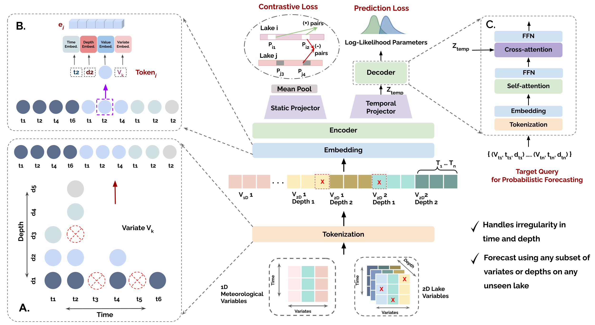

# LakeFM: Toward a Foundation Model for Aquatic Ecosystems Using Irregular Multivariate Multi-depth Time Series Data


Understanding and forecasting lake dynamics is critical for monitoring water quality and ecosystem health across lakes and reservoirs. While machine learning methods have been recently applied to ecological time-series data, existing works assume regular sampling in time and depth, and struggle to generalize across lakes with heterogeneous variables, depths, and observation patterns. To address these limitations, we introduce LakeFM, a foundation model for aquatic systems, pre-trained on large-scale ecological datasets comprising both simulated and observed lakes. Through extensive empirical evaluation, we show that LakeFM learns meaningful representations spanning broader lake-level characteristics, and achieves competitive or often superior-forecasting performance compared to existing time-series foundation and non-foundation models, while producing physically plausible predictions consistent with real-world lake dynamics.

## Repository Structure

```plaintext
project_root/
├── src/
│   ├── cli/
│       ├── conf/                   # model and data config yamls
│       ├── main.py                 # driver script          
│   ├── data/
│       ├── builder/                # dataset-specific builder classes
│       ├── dataset.py              # dataset class for training
│       ├── eval_dataset.py         # dataset class for evaluation 
│       ├── loader.py               # loader
│   ├── lakefm/
│       ├── model.py
│       ├── trainer.py
│       ├── evaluator.py         
│   └── utils/                
|   └── scripts/                     
│
└── resources/
    ├── data/                       # datasets
    ├── dev/
        ├── norm_stats              # normalization stats for lakefm
        ├── pretain_ckpts
```

## ⚙️ Environment Setup

### 1. Create a new conda environment

```bash
conda create -n lakefm python=3.11
```
### 2. Activate the environment

```bash
conda activate lakefm
```
### 3. Install dependencies

Make sure you have the `requirements.txt` file available in the project directory.

Then install all required packages using `pip`:

```bash
pip install -r requirements.txt
```
### 4. (Optional) Verify installation

You can check that all necessary packages are installed:

```bash
pip list
```

### 5. Install PyTorch separately

You must install PyTorch separately according to your **CUDA version**.
Refer to the official PyTorch guide:

👉 https://pytorch.org/get-started/previous-versions/


### Example install command for CUDA 11.8:

```bash
pip install torch==2.6.0+cu118 torchvision==0.21.0+cu118 torchaudio==2.6.0 --extra-index-url https://download.pytorch.org/whl/cu118
```

## Datasets & Checkpoints

For using any of the data and/or ckpt, add them to the corresponding dir (mentioned for each of them below) under `resources`. 

1. FCR Simulation dataset [Download](https://drive.google.com/file/d/19kR_CIA3Z-bmx1I7ef5ziFNG2bgEuPAH/view?usp=drive_link) (`/resources/lakefm/data/FCR_data`)

2. WQHanson Simulation dataset [Download](https://drive.google.com/file/d/1GKB0xqkmKJHCIWBSPoP5hBFhE-IOW9cH/view?usp=drive_link) (`/resources/lakefm/data/WQHanson_Simulation`)

3. LakeBeD dataset [Download](https://drive.google.com/file/d/10OzRxqh0RIrM7XMFY7wvlYT36uIGMjnZ/view?usp=drive_link) (`/resources/lakefm/data/LakeBeD-US`)

LakeFM 5M Checkpoint [Download](https://drive.google.com/file/d/1YDlnLUG37rOfV-yr8dfOj4UXFNSj2QAB/view?usp=drive_link) (`resources/lakefm/dev/pretrain_ckpts`)

---
## Running the code

Navigate to the `src/` directory:

```bash
cd src
```

Run eval for a lake

```
bash scripts/driver.sh <run_name> <lake_name>
```
`<run_name>` is where the output of the evaluation gets stored (it is the name of the output folder) <br>
`<lake_name>` lake to be evaluated (e.g. AL, BARC, etc)

Example: 
```
bash scripts/driver.sh eval_BARC BARC
```

1. To run denormalized evaluation,

   ```bash scripts/driver.sh <run_name> <lake_name> --denorm```

2. To generate plots,

   ```bash scripts/driver.sh <run_name> <lake_name> <depth_m> --plot```

   or
   
   ```bash scripts/driver.sh <run_name> <lake_name> --plot --depth <depth_m>```

   where `depth_m` is the depth at which to plot

3. To plot for a subset of variables

    ```bash scripts/driver.sh <run_name> <lake_name> <depth_m> --plot --vars '["WaterTemp_C","Water_DO_mg_per_L"]'```

   plots for Water Temp and Water DO

4. To perform variable masking

   ```bash scripts/driver.sh <run_name> <lake_name> --mask-vars '["WaterTemp_C","Chla_ugL"]'```

   masks Water Temp and Chla. To generate plots, pass `--plot` and `--vars` with the list of variables to plot

5. To perform depth masking

   ```bash scripts/driver.sh <run_name> <lake_name> --mask-depths '[1.0,2.0,5.0]'```
   
   
